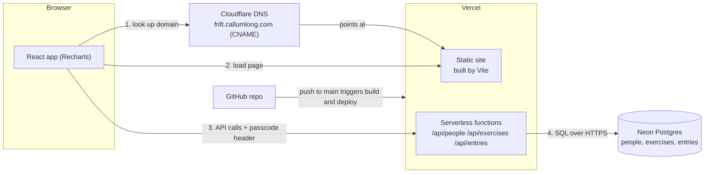

# FRIFT

A small web app for a group of friends (up to 10) to log their lifting and compare progress. Everyone logs sets against a shared list of exercises, and every exercise gets a line chart with one coloured line per person. The point is measuring **relative progress between people**, so the app offers several ways to look at the same data.

Live at **https://frift.callumlong.com**.

---

## Contents

1. [What it does](#what-it-does)
2. [How the numbers work](#how-the-numbers-work)
3. [Architecture and infrastructure](#architecture-and-infrastructure)
4. [Environment variables](#environment-variables)
5. [Data model](#data-model)
6. [API reference](#api-reference)
7. [Project structure](#project-structure)
8. [How the front end works](#how-the-front-end-works)
9. [Setting it up from scratch](#setting-it-up-from-scratch)
10. [Deploying changes](#deploying-changes)
11. [Local development and tests](#local-development-and-tests)
12. [Operations cookbook (SQL)](#operations-cookbook-sql)
13. [Daily Discord post](#daily-discord-post)
14. [Security and limits](#security-and-limits)
15. [Troubleshooting](#troubleshooting)

---

## What it does

- **Grid of charts.** Every tile is the same fixed height (340px), however many people there are. On a wide screen the page is four columns. The left three are **Weight training** (weight × reps exercises) and the far right column is **Cardio & calisthenics** (cardio and reps-only exercises). New exercises go to the matching section automatically. Cardio & calisthenics tiles use a very slightly cooler panel colour. Above both sections, the **top tile** (A1) runs the full width, in four sections: controls, the Last 3 weeks grid, the activity log, and Google Sheets upload. On smaller screens the board drops to two columns and then one, with Weight training first, and the top tile becomes 2 × 2 and then one section above another (it is the only tile that grows to fit).
- **Who are you?** A dropdown in A1 picks who you are, or adds a new person. Choosing yourself thickens your line on every chart, dims everyone else's, and switches on the **+** button on each chart. Your choice is remembered in your browser. There is no separate legend: each name in the Last 3 weeks grid has a line sample in that person's colour, so the grid is the key for the charts.
- **Logging sets.** Tap **+** on a chart to log sets for that exercise. Every set is logged separately (weight and reps, or just reps for reps-only exercises). You can add several sets at once, pick the date, and delete your own entries to fix mistakes.
- **Barbell or dumbbell.** Exercises that allow it (Bench press, Squat and Shoulder press to start with) ask whether each batch of sets was barbell or dumbbell.
- **Four chart modes** (radio buttons in A1): Total, % change, Best set and **× BW** (best set as a multiple of body weight). Hover a mode for its full name. See [How the numbers work](#how-the-numbers-work).
- **Body weight.** A field under the chart options logs your body weight for today (one reading per day; saving again replaces it). There is no body weight tile: it is only used by the × BW mode. Hover the field to see your last reading.
- **Assisted exercises.** Log the assistance as a minus weight, e.g. `-20` for a pull up with 20 kg of help. Less assistance counts as a better set and as a PR.
- **Full screen.** Every chart tile has an expand button (⤢) beside the **+** that opens it full screen, with more dates on the axis. Escape or × closes it.
- **Running.** A tile of its own in Cardio & calisthenics (Cardio is unchanged). A dropdown at the top picks **Easy**, **Tempo** or **Intervals**, and **+** logs a run of that type with a distance (km) and a time (minutes and seconds). Easy charts the distance per day. Tempo charts the best pace, for **5K**, **10K** or **All** (a switch under the dropdown; 5K and 10K allow 5% either way); tempo has 5 km and 10 km quick-pick buttons when logging. Intervals are logged as several distance-and-time pairs and chart the session's average pace (total time ÷ total distance). Pace charts are upside down so faster is higher. Your dropdown and switch choices are remembered in your browser.
- **Equalise.** A checkbox in A1 that counts dumbbell sets at double weight so they can be compared with barbell lifts. Hover or focus "What is this?" beside it for a one-line explanation.
- **Hover details.** Hover a date on any weight × reps chart to see every person's value for that day and every set they did.
- **Add exercise.** A tile after the last chart lets anyone add a new exercise (up to 25 in total), logged either as weight × reps or as **reps only** (for bodyweight moves like pull-ups). New charts appear for everyone.
- **Last 3 weeks.** The second section of A1, with nothing to scroll. One row per person, one box per day, for the current week plus the two before it (`ACTIVITY_WEEKS` in `src/lib/constants.js`). Newest first: the current week comes first, each week runs Sunday back to Monday, and each week is labelled with its Monday's date. A filled box in that person's colour means they logged a set or cardio session that day; hovering it names what. Days later in the current week show as dashed, empty boxes. Today's column is outlined all the way down every row. The rows shrink evenly when there are too many people to fit at full size, the boxes stretch to fit the width, and when it is narrow the names shorten to their first three letters (hover for the full name).
- **Activity log.** The third section of A1: the last 5 sessions logged (one person, one day), newest first, with the exercises done. The line below says how many PRs that session set, with a 🏆 and the exercise names. A PR means the session's best beat every earlier session of that exercise by that person: the heaviest weight for weight × reps (barbell and dumbbell counted separately), the most reps in a set for reps-only, and the longest time for cardio. The first ever session of an exercise sets a baseline rather than a PR.
- **Google Sheets upload.** The fourth section of A1 is a placeholder for instructions on logging sets automatically from a Google Sheet, coming in a later version.
- **Daily Discord post.** At 8pm UK time, FRIFT posts to the group's Discord channel: one message per person who logged anything that day, listing their exercises and showing the sets of any PR with a 🏆. See [Daily Discord post](#daily-discord-post).
- **Dark only.** The app is always dark. Each person's stored colour is shown as a lighter twin, so lines stay easy to read on a dark background; the database still stores the original colour.
- **Cardio.** Logged as minutes, one entry per person per day.
- **Shared passcode.** Everyone types one group passcode to get in.

Starting exercises: Bench press, Lat pull down, Squat, Leg extension, Shoulder press, Incline dumbbell curl, Cardio.

---

## How the numbers work

Sets are stored one row per set. All the chart maths happens in the browser (`src/lib/metrics.js`), not in the database.

| Mode | What one point on a chart means |
|---|---|
| **Total weight** | For one person, one exercise and one day: the sum of weight × reps over the **last 3 sets** of that day. Only 3 sets count, so someone doing 5 sets does not look stronger than someone doing 3. |
| **% change** | The total weight above, shown as % change from that person's **own first logged day** for that exercise. Every line starts at 0%. A person whose first value is zero is left out, because change from zero is undefined. |
| **Best set** | The day's best set is the one with the highest weight × reps, looking at **all** sets that day (not only the last 3). The vertical axis is that set's **weight**; hover a point to see its reps. |
| **Reps-only exercises** | Reps stand in for weight × reps: **total** is the reps over the last 3 sets, **% change** is change in that total, and **best set** is the most reps in one set. Equalise does not apply. |
| **× BW** | The best set's weight (as in Best set, doubled for dumbbells when Equalise is on) divided by that person's body weight: the latest reading on or before that day, or their first reading for earlier days. 100 kg at 80 kg body weight is 1.25×. People with no body weight logged are left out. Reps-only and cardio charts show the same as Best set. |
| **Cardio** (any mode) | Minutes per day. |
| **Running** (own switch, ignores the mode) | Easy: km per day. Tempo: fastest pace that day at the chosen distance. Intervals: total time ÷ total distance for the session. |

Other rules:

- **"Last 3 sets"** means the three highest set numbers of that day, not the three most recently saved rows.
- **Set numbers** continue through the day. If you logged sets 1 and 2 this morning, the next set you add is set 3.
- **Equalise** multiplies the weight of dumbbell sets by 2, in every mode. Dumbbell weights are entered as the weight of **one** dumbbell, so doubling gives the total moved and makes dumbbell and barbell lifting comparable. It can change which set counts as "best" when it is on. Sets with no equipment recorded (older entries) count as barbell.
- **Several people, different dates.** The x axis is a shared date axis. Lines join up across days a person did not train.
- **Hover card.** In total and % change modes, the last 3 sets are bold and earlier sets are faded (they don't count). In best set mode only the best set is bold. Dumbbell sets are tagged "DB".

Changing how many sets count: `COUNTED_SETS` in `src/lib/constants.js`.

---

## Architecture and infrastructure



### The four services

| Service | What it does here | Where to manage it |
|---|---|---|
| **GitHub** | Holds the source code. A push to the main branch triggers a deployment. | github.com, your `frift` repository |
| **Vercel** | Builds the site with Vite and hosts it. Also runs the files in `/api` as serverless functions. Holds the environment variables. | vercel.com, project `frift` |
| **Neon** | The Postgres database. It stores people, exercises and every logged set. | console.neon.tech, the project whose connection string is in `DATABASE_URL` |
| **Cloudflare** | DNS for `callumlong.com`. A `CNAME` record sends `frift.callumlong.com` to Vercel. | Cloudflare dashboard, DNS records |

### Request flow

1. The browser loads `https://frift.callumlong.com`. Cloudflare DNS resolves it to Vercel, which serves the built React app.
2. The app asks for the passcode (or uses the one saved in the browser) and calls `/api/people`, `/api/exercises` and `/api/entries` in parallel.
3. Each function checks the `x-frift-passcode` header against `FRIFT_PASSCODE`, then queries Neon using the `DATABASE_URL` connection string.
4. The browser builds the charts from the returned data. Saving a set is a `POST` to `/api/entries`, and the page updates from the response.

### Notes on each piece

- **Vercel functions** are plain Node functions in `/api`. Files starting with `_` (`_db.js`, `_http.js`, `_validate.js`) are shared helpers and are **not** public endpoints. Environment variables only take effect on **new** deployments, so redeploy after changing one.
- **Neon** is accessed with the `@neondatabase/serverless` driver over HTTPS, which suits short-lived serverless functions. Use the **pooled** connection string for `DATABASE_URL`. Neon may pause an idle database and wake it on the next request, so the first request after a quiet spell can be slightly slower.
- **Only one Neon project is in use:** the one your `DATABASE_URL` points at. Neon projects created by earlier connection attempts are unused and can be deleted once you have confirmed which one holds your data.
- **Cloudflare** must use **DNS only** (grey cloud) for the `frift` record so Vercel can issue the HTTPS certificate. The `CNAME` target is whatever Vercel shows under Settings > Domains for this project, often `cname.vercel-dns.com`.
- **Cost:** the app is small enough that it should sit within the free tiers of Vercel and Neon. Check their current limits if usage grows.

---

## Environment variables

Set in Vercel: project > Settings > Environment Variables.

| Name | Required | What it is |
|---|---|---|
| `DATABASE_URL` | Yes | Neon connection string, including the password. Treat as a secret. |
| `FRIFT_PASSCODE` | Yes | The shared group passcode. Treat as a secret. |
| `POSTGRES_URL` | No | Older name for the database URL. Used only if `DATABASE_URL` is missing. |
| `DISCORD_WEBHOOK_URL` | For the Discord post | The #fitness channel's webhook URL. Anyone with it can post in that channel, so treat it as a secret. |
| `CRON_SECRET` | For the Discord post | Any long random string. Vercel sends it with its scheduled calls, and the endpoint only accepts them if it matches. Treat as a secret. |

Other variables the Neon integration created (`DATABASE_URL_UNPOOLED`, `PG...`) are **not used** by the app. Do not rename these with a `VITE_` prefix: in a Vite project, anything starting with `VITE_` is sent to the browser.

Locally, `.env.example` shows the shape. Never commit a real `.env` file (it is in `.gitignore`).

---

## Data model

Defined in `schema.sql`. The script is **idempotent**: safe to run again on a live database, and it does not touch existing rows. Run it in Neon's SQL Editor.

### `people`

| Column | Notes |
|---|---|
| `id` | Auto number. |
| `name` | Unique ignoring case ("Sam" and "sam" cannot both exist). 1 to 24 characters. |
| `colour` | Line colour, given out in order from a fixed palette of 10. |
| `created_at` | |

### `exercises`

| Column | Notes |
|---|---|
| `id` | Text slug, for example `bench_press`. Made from the name when an exercise is added. |
| `name` | Unique ignoring case. 1 to 30 characters. |
| `kind` | `strength` (weight × reps), `reps` (reps only, no weight) or `cardio` (minutes). Exercises added in the app are `strength` or `reps`. |
| `equipment_choice` | `true` means each batch of sets is logged as barbell or dumbbell. |
| `created_by` | The person who added it, or empty for the starting seven. |
| `sort_order` | Charts are shown in this order, so new exercises appear at the end. |
| `created_at` | |

### `entries` (one row per set)

| Column | Notes |
|---|---|
| `id` | Auto number. |
| `person_id` | Whose set it is. Deleting a person deletes their entries. |
| `exercise` | Must match `exercises.id`. |
| `entry_date` | The day the set was done. |
| `set_number` | 1, 2, 3 ... through the day, per person per exercise. |
| `weight` | kg. For dumbbells, the weight of **one** dumbbell. Negative for assisted sets (the assistance). Empty for cardio, running and reps-only exercises. |
| `reps` | Whole number. Empty for cardio. |
| `duration_min` | Minutes. Cardio only. |
| `run_type` | `easy`, `tempo` or `intervals`. Running only. |
| `distance_km` | Km, two decimals. Running only. |
| `duration_sec` | Whole seconds. Running only. |
| `equipment` | `'barbell'` or `'dumbbell'` (lowercase, exactly), or empty. Empty counts as barbell. |
| `created_at` | |

### `body_weights` (one reading per person per day)

| Column | Notes |
|---|---|
| `person_id` | Whose reading it is. |
| `entry_date` | The day. Together with `person_id`, the key, so logging again that day replaces it. |
| `weight_kg` | 20 to 400, one decimal. |
| `created_at` | |

### Rules enforced by the database

- Cardio rows need only `duration_min`. Running rows need `run_type`, `distance_km` and `duration_sec` and nothing else. Other rows need `reps` (the API also requires `weight` unless the exercise is reps only).
- Reps at least 1; minutes, distance and time above 0. Weight may be negative (assisted); the API keeps it between -500 and 1000 kg.
- `equipment` can only be `barbell`, `dumbbell` or empty.
- A person cannot have two entries with the same exercise, date and set number.
- **One cardio entry per person per day.**
- Every entry's exercise must exist in `exercises`.

---

## API reference

All endpoints live under `/api`, take and return JSON, and are never cached.

**Authentication:** every request must send the header `x-frift-passcode: <the group passcode>`. A wrong or missing passcode gets `401`.

**Errors** look like `{ "error": "Readable message" }`. Status codes: `400` invalid input, `401` wrong passcode, `404` not found, `405` wrong method, `409` conflict (duplicate or over a limit), `500` server problem (check the Vercel logs).

| Endpoint | What it does |
|---|---|
| `GET /api/people` | All people: `id`, `name`, `colour`. |
| `POST /api/people` | Add a person. Body: `{ "name": "Sam" }`. The colour is assigned automatically. Fails with `409` if the name is taken or 10 people already exist. |
| `GET /api/exercises` | All exercises in chart order: `id`, `name`, `kind`, `equipment_choice`, `created_by`, `sort_order`. |
| `GET /api/daily-discord` | Post a day's entries to Discord now and return `{ date, posted, webhook, links }`, with a link to each message posted. `?check=1` posts nothing and only reports the webhook's server and channel. Defaults to today (UK time); add `?date=2026-09-22` for another day. Vercel Cron calls it at 8pm with `CRON_SECRET` instead of the passcode. |
| `POST /api/exercises` | Add an exercise. Body: `{ "name": "Romanian deadlift", "personId": 1, "kind": "strength", "equipmentChoice": true }`. `kind` is `strength` (weight × reps, the default) or `reps` (reps only; `equipmentChoice` is ignored). Fails with `409` if the name exists or 25 exercises exist. |
| `GET /api/entries` | Every logged set, oldest first: `id`, `person_id`, `exercise`, `date` (`YYYY-MM-DD`), `set_number`, `weight`, `reps`, `duration_min`, `equipment`. |
| `POST /api/entries` | Log sets (see below). Returns the rows created. |
| `DELETE /api/entries?id=12&personId=3` | Delete one entry. Only succeeds if it belongs to that person. |
| `GET /api/bodyweights` | Every body weight reading: `person_id`, `date`, `weight_kg`. |
| `POST /api/bodyweights` | Log a body weight. Body: `{ "personId": 1, "date": "2026-09-23", "weightKg": 80.5 }`. Replaces that person's reading for that day. |

**Logging a run:** `{ "personId": 1, "exercise": "running", "date": "2026-09-23", "runType": "tempo", "runs": [ { "distanceKm": 5, "seconds": 1450 } ] }`. Easy and tempo take one run; intervals take up to 10, one per interval.

**Logging strength sets:**

```json
{
  "personId": 1,
  "exercise": "bench_press",
  "date": "2026-09-19",
  "equipment": "dumbbell",
  "sets": [ { "weight": 30, "reps": 10 }, { "weight": 32, "reps": 8 } ]
}
```

- `equipment` is required for exercises with the barbell/dumbbell choice, and ignored for the rest.
- Set numbers continue from whatever that person already logged that day. All sets in one request are saved together or not at all.

**Logging cardio:**

```json
{ "personId": 1, "exercise": "cardio", "date": "2026-09-19", "durationMin": 30 }
```

**Input limits:** date no earlier than 2020 and no more than a day ahead; weight 0 to 1000 kg; reps whole number 1 to 200; up to 10 sets per request; cardio 1 to 600 minutes.

---

## Project structure

```
frift/
├── api/                       Vercel serverless functions
│   ├── people.js              GET / POST people
│   ├── bodyweights.js         GET / POST body weight readings
│   ├── exercises.js           GET / POST exercises
│   ├── entries.js             GET / POST / DELETE entries
│   ├── daily-discord.js       8pm Discord post (Vercel Cron)
│   ├── _http.js               passcode and cron checks, method routing, JSON errors
│   ├── _discord.js            builds the Discord messages
│   ├── _db.js                 Neon connection (reads DATABASE_URL)
│   └── _validate.js           input checking and exercise-name slugs
├── src/                       the React app
│   ├── main.jsx               entry point, top-level error screen
│   ├── App.jsx                loads data, holds state, lays out the grid
│   ├── api.js                 fetch wrapper that adds the passcode header
│   ├── styles.css             all styling
│   ├── components/
│   │   ├── ControlPanel.jsx       top tile: who you are, chart mode, equalise, and its other sections
│   │   ├── ActivityStrip.jsx      the last-3-weeks logged/not-logged grid
│   │   ├── ActivityLog.jsx        recent sessions and their PRs
│   │   ├── SheetsInfo.jsx         Google Sheets upload placeholder
│   │   ├── ChartFrame.jsx         a chart tile's header, + and expand buttons, full-screen view
│   │   ├── LinesChart.jsx         the line chart every tile draws
│   │   ├── ExerciseChart.jsx      a weights, reps or cardio chart and its hover card
│   │   ├── RunningChart.jsx       the Running tile: run type, tempo distance, pace
│   │   ├── AddEntryDialog.jsx     the + dialog for logging sets and cardio
│   │   ├── AddExerciseTile.jsx    the "Add exercise" tile
│   │   ├── AddExerciseDialog.jsx  dialog for creating an exercise
│   │   ├── PasscodeGate.jsx       passcode screen
│   │   └── ErrorBoundary.jsx      stops one failure blanking the whole page
│   └── lib/
│       ├── constants.js       limits, modes, colour palette (shared with /api)
│       ├── theme.js            dark colour lookups for the charts
│       ├── metrics.js         all chart calculations
│       └── storage.js         safe localStorage helpers
├── test/                      unit tests (49)
├── vercel.json                schedule for the Discord post
├── schema.sql                 database setup and upgrades (safe to re-run)
├── index.html                 page shell and fonts
├── vite.config.js
├── package.json
└── .env.example
```

**Stack:** Vite, React 19, Recharts 3, Neon serverless Postgres driver. Plain JavaScript, no TypeScript. Fonts are Barlow and Barlow Condensed from Google Fonts.

---

## How the front end works

- **Loading.** On start, the app loads people, exercises and all entries together. It reloads quietly whenever you switch back to the tab, so friends' new entries appear without a manual refresh.
- **Charts are calculated in the browser.** The database just stores sets. The browser groups them by person, exercise and day and applies the current mode and Equalise setting. With under 10 people this stays fast for years of data.
- **Saved in your browser (localStorage):**

  | Key | Holds |
  |---|---|
  | `frift.passcode` | The passcode you entered. A `401` clears it and shows the passcode screen again. |
  | `frift.me` | Who you picked in A1. |
  | `frift.mode` | `total`, `pct`, `best` or `bw`. |
  | `frift.equalise` | Whether Equalise is ticked. |
  | `frift.runType` | The run type the Running tile shows. |
  | `frift.tempoDistance` | `5k`, `10k` or `all` for the Tempo chart. |

  None of this is shared between people or devices.
- **Dialogs** use the browser's built-in `<dialog>` element, so Escape closes them and focus is handled for you.
- **Failure handling.** If one chart fails to draw, only that panel shows a message. If the whole page fails, you get a message with the error and a Reload button rather than a blank page.

---

## Setting it up from scratch

1. **GitHub.** Create an empty repository called `frift`, then from the project folder:

   ```bash
   git init
   git add .
   git commit -m "FRIFT"
   git remote add origin git@github.com:<your-username>/frift.git
   git branch -M main
   git push -u origin main
   ```

2. **Vercel.** Add New > Project > import the `frift` repo. Vercel detects Vite, so leave the defaults and deploy.
3. **Neon.** Add Neon from the Vercel Marketplace and connect it so `DATABASE_URL` is set. (If the connect step complains that a variable already exists, the connection is already made. Check Settings > Environment Variables instead.) Open the database in Neon, go to the **SQL Editor**, paste in all of `schema.sql` and run it.
4. **Passcode.** In Vercel, add `FRIFT_PASSCODE` under Settings > Environment Variables, then redeploy.
5. **Domain.** In Vercel, Settings > Domains, add `frift.callumlong.com` and note the `CNAME` target it shows. In Cloudflare, DNS > Records, add a `CNAME` named `frift` with that target, set to **DNS only**. Vercel shows a tick once it verifies (usually within minutes).
6. Open the site, enter the passcode, choose **Add a new person** in A1, and add yourself.

---

## Deploying changes

Vercel deploys automatically whenever you push to GitHub. In VS Code: open Source Control, write a message, **Commit**, then **Sync Changes**. Watch progress under **Deployments** in Vercel.

**When a change touches the database, do it in this order:**

1. Run the updated `schema.sql` in Neon's SQL Editor **first**. It only adds things, so the currently live version keeps working while you do it.
2. Then push the code.

If the new code goes live before the database change, the app cannot load its data.

**Rolling back:** in Vercel > Deployments, open the menu on an earlier working deployment and choose Instant Rollback (or Promote to Production). Database changes made by `schema.sql` are additive, so older code keeps working against a newer database.

---

## Local development and tests

```bash
npm install
npm i -g vercel
vercel link
vercel env pull .env.local
npm run dev        # runs "vercel dev": the site and /api together
```

Plain `vite` (`npm run dev:ui`) only serves the front end; `/api` needs the Vercel CLI. Local runs use the same Neon database as the live site unless you point `.env.local` somewhere else, so be careful with test data (or use a Neon branch).

```bash
npm test           # unit tests, no database needed
```

The tests cover the chart maths (last 3 sets, best set, equalise, % change, reps-only exercises, tooltip data), the passcode check, and input validation. They do not draw real charts or talk to a real database.

---

## Operations cookbook (SQL)

Run these in Neon's SQL Editor. Values like `'dumbbell'` must be **lowercase and exact** or the database rejects them. Before anything risky, make a **Neon branch** (an instant copy of the database) so you can go back.

**See who logged what:**

```sql
select e.id, p.name, e.exercise, e.entry_date, e.set_number, e.weight, e.reps, e.equipment
from entries e join people p on p.id = e.person_id
where e.exercise = 'shoulder_press'
order by e.entry_date, e.set_number;
```

**Mark old entries as dumbbell** (and halve the weight if you had logged both dumbbells combined):

```sql
update entries set equipment = 'dumbbell' where id in (12, 13, 14);
update entries set equipment = 'dumbbell', weight = weight / 2 where id = 15;
```

**Rename a person:**

```sql
update people set name = 'Sam' where id = 2;
```

**Rename an exercise** (the id stays the same):

```sql
update exercises set name = 'Romanian deadlift' where id = 'romanian_deadlift';
```

**Turn the barbell/dumbbell choice on or off for an exercise:**

```sql
update exercises set equipment_choice = true where id = 'lat_pulldown';
```

**Remove an exercise and all its entries** (cannot be undone):

```sql
delete from entries where exercise = 'romanian_deadlift';
delete from exercises where id = 'romanian_deadlift';
```

**Remove a person and all their entries** (cannot be undone):

```sql
delete from people where id = 3;
```

**Change the passcode:** edit `FRIFT_PASSCODE` in Vercel and redeploy. Everyone will be asked for the new one next time they open the site.

**Check the database matches what the code expects:**

```sql
select table_name, column_name from information_schema.columns
where column_name in ('equipment', 'equipment_choice');
```

You should see two rows: `entries / equipment` and `exercises / equipment_choice`.

---

## Daily Discord post

At **8pm UK time** every day, FRIFT posts to the group's Discord channel: **one message per person** who logged anything that day, in the order people joined. Each is one line listing their exercises in the order they logged them, for example:

> Sam worked out today ✅ -> Bench press, Squat, Shoulder press [PR! 34kg x 10, 40kg x 10 🏆, 40kg x 10], Seated row.

An exercise where they hit a PR is followed by all its sets in brackets, with 🏆 on the set that made the record (the first to reach the day's best). PRs use the same rule as the activity log. Reps-only sets show as `12 reps`, cardio as `30 min`, and `DB` marks dumbbell sets. If no one logged anything, nothing is posted. Entries count toward the day they were logged **for**, so a set added after 8pm (or for an earlier date) is not posted.

**Timing.** Vercel schedules are in UTC, so `vercel.json` calls the endpoint at both 19:00 and 20:00 UTC, and only the call that falls in the 8pm hour in London posts. That keeps it at 8pm through summer and winter time. On Vercel's free Hobby plan a scheduled call can arrive any time within its hour, so the post can land between 8:00 and 8:59pm. Each posted day is recorded in the `discord_posts` table, so a repeated call cannot post twice.

**Setting it up:**

1. Run the latest `schema.sql` in Neon (it adds the `discord_posts` table).
2. In Discord: open **#fitness** > **Edit Channel** > **Integrations** > **Webhooks** > **New Webhook**. Name it FRIFT, then **Copy Webhook URL**. You need the Manage Webhooks permission on the server.
3. In Vercel > Settings > Environment Variables, add `DISCORD_WEBHOOK_URL` (that URL) and `CRON_SECRET` (any long random string), then redeploy.
4. To test without waiting for 8pm, open the browser console on the live site and run the line below. It posts today's messages straight away and does not stop the 8pm post.
   `await (await fetch('/api/daily-discord', { headers: { 'x-frift-passcode': localStorage.getItem('frift.passcode') } })).json()`

   The result includes `links`, one per message posted: open one to jump straight to it in Discord. To see which server and channel the webhook posts to **without** posting anything, add `?check=1` to the address (`/api/daily-discord?check=1`); the `channelLink` in the result opens that channel. FRIFT refuses a `DISCORD_WEBHOOK_URL` that is not a webhook (for example a copied channel link), with a message saying so.

Each run's result is in Vercel > Logs (search for "Discord post").

---

## Security and limits

- **The passcode is the only lock.** It stops strangers using the app or filling the database. The "who are you" dropdown is **not** a login: anyone with the passcode can log as anyone. That is fine for friends, but do not treat it as security.
- **Secrets stay on the server.** `DATABASE_URL`, `FRIFT_PASSCODE`, `CRON_SECRET` and `DISCORD_WEBHOOK_URL` are only read by the API functions and are never sent to the browser. In Vercel, mark both as **Sensitive** if the option is offered.
- **The browser never talks to the database directly.** Every read and write goes through a function that checks the passcode and validates the input.
- **The passcode is saved in the browser** so people don't retype it. Anyone using the same browser profile is treated as having it.
- **Limits:** 10 people, 25 exercises, 10 sets per save, weights in kg.
- **No delete in the app for exercises, and only your own entries can be deleted.** This is deliberate, so a mis-tap can't remove someone's history. Use the SQL cookbook for anything else.

---

## Troubleshooting

| What you see | Likely cause | What to do |
|---|---|---|
| Passcode screen keeps coming back | Wrong passcode, or `FRIFT_PASSCODE` was changed | Enter the current one. If it never works, check the variable is spelled exactly `FRIFT_PASSCODE` and that you redeployed after adding it. |
| Red banner "Could not load the data" | The API or database failed | Vercel > Logs shows the real error. Check `DATABASE_URL`, and that `schema.sql` was run in the **same** Neon project the URL points to. |
| Error mentions a missing column (`equipment`, `equipment_choice`) | Code deployed before the database update | Run the latest `schema.sql` in Neon, then refresh. No redeploy needed. |
| "FRIFT_PASSCODE is not set on the server" | Variable missing for that environment | Add it under Settings > Environment Variables for Production, then redeploy. |
| Page loads but is grey and empty | A front-end crash. Newer versions show a message with the error instead, but an old version may still blank | Press F12, open the Console tab, and copy the red error. Or roll back in Vercel. |
| One chart says "could not be drawn" | That chart hit a data problem | The rest of the app is fine. The message names the error. |
| `violates check constraint "entries_equipment_check"` | `equipment` was set to something other than exactly `'barbell'` or `'dumbbell'` | Use lowercase, for example `'dumbbell'`. |
| `violates foreign key constraint` | An entry uses an exercise that is not in `exercises` | Add the exercise, or correct the entry's exercise id. |
| Vercel says "Invalid Configuration" for the domain | DNS record wrong or still spreading | Check the Cloudflare record is a `CNAME` named `frift`, its target is exactly the hostname Vercel shows, and it is set to DNS only. Wait a few minutes. |
| Cloudflare says "Content for CNAME record is invalid" | Target has `https://`, a space, or extra text | Paste only the bare hostname. If Vercel shows an IP address, add an `A` record instead. |
| Changed an environment variable but nothing changed | Variables apply only to new deployments | Redeploy from the Deployments tab. |
| Someone's new entry doesn't appear | Their tab loaded before the change | Switch away from the tab and back, or refresh. The page reloads data when it regains focus. |
| Vercel's Storage page won't connect Neon and mentions an existing variable | The Neon integration was already connected | You don't need to reconnect. Confirm `DATABASE_URL` exists under Environment Variables. |
